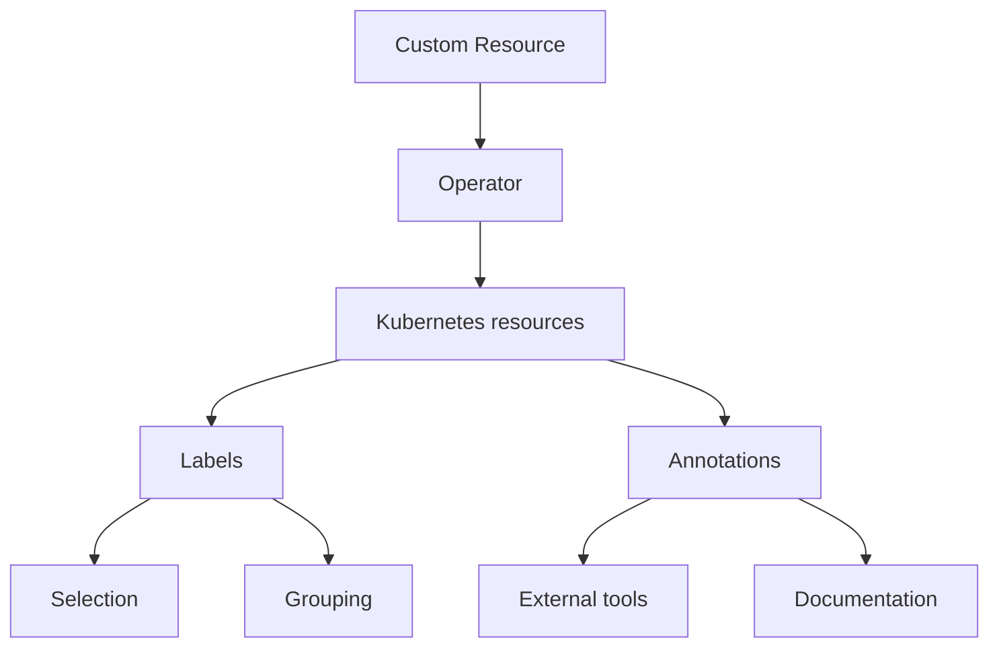

## Mermaid.js in dark mode test

Testing Mermaid in Material for MkDocs, regarding dark mode, wheree the labels don't inherit the right color.

```mermaid
graph TD
    A[Custom Resource] --> B[Operator]
    B --> C[Kubernetes resources]
    C --> D[Labels]
    C --> E[Annotations]
    D --> F[Selection]
    D --> G[Grouping]
    E --> H[External tools]
    E --> I[Documentation]
```